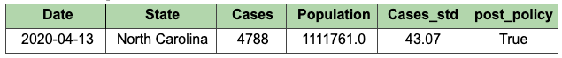
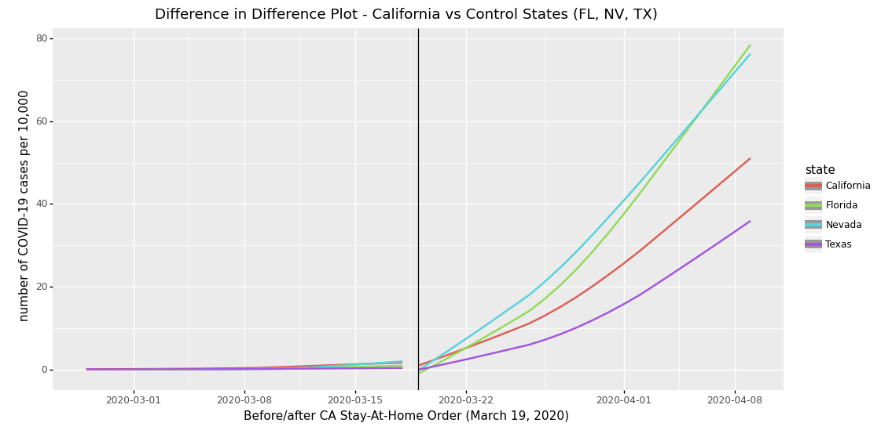
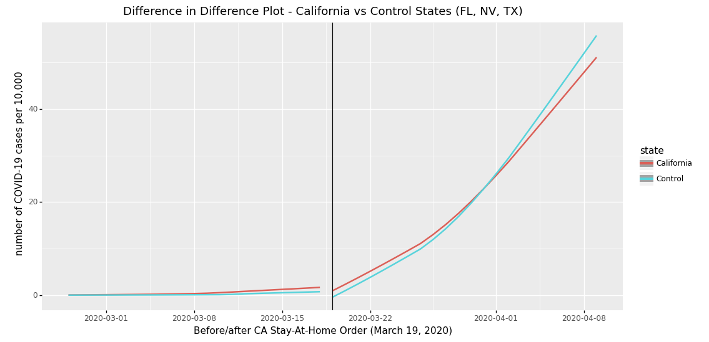

# COVID-19 Policy Impact Analysis — for public health policy maker

## Project Goals

We are interested to see if the swiftness of US state policy and their reaction times have any effect in controlling the subsequent growth of new cases. Specifically, we would like to investigate if there exists a causal relationship between policy announcement and the following changes in COVID-19 cases.

## Research Design

Difference-in-diference / Causal Inference

We compared the COVID-19 cases growth rate for 3 weeks before and 3 weeks after the implementation of a Stay-At-Home order for our four treatment and their control states.

## Data 

COVID-19 case data used in this analysis is from the New York Times [Github repository](https://github.com/nytimes/covid-19-data)

Population data is from the US Census Bureau, which can be found here [link](https://www.census.gov/topics/population.html)

#### Unit of Observation

Below is an example of how each row in our final dataset looks like:
 \

## Example Result

 \
*California vs. control states, individual level*

 \
*California vs. control states, overall  average*

